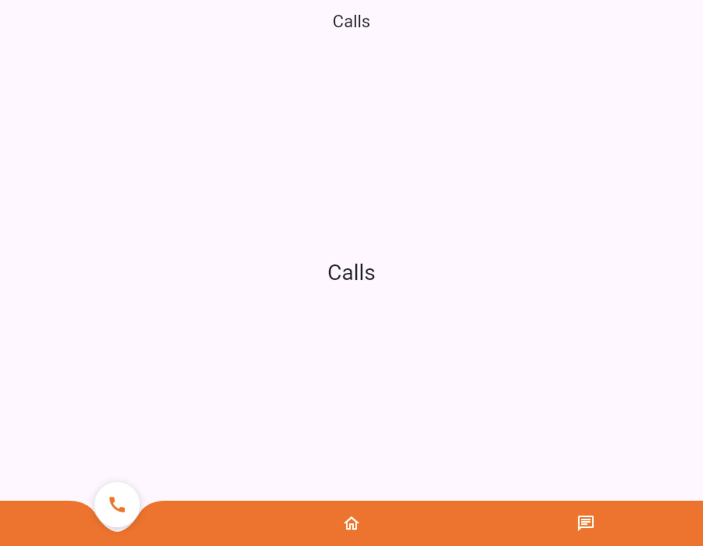

# curved_bottom_nav_bar_animated

A customizable curved bottom navigation bar for Flutter with an animated floating bubble that highlights the active tab.



## Features

- Smooth curved notch painted behind the active item
- Animated floating bubble that slides between tabs
- Fully configurable sizes, colors, notch shape and animation timing
- Optional distinct active icons and accessibility labels
- Respects the bottom safe-area inset

## Installation

Add it to your `pubspec.yaml`:

```yaml
dependencies:
  curved_bottom_nav_bar_animated: ^1.0.0
```

## Usage

Create a stateful page and update `currentIndex` when an item is tapped:

```dart
import 'package:curved_bottom_nav_bar_animated/curved_bottom_nav_bar_animated.dart';
import 'package:flutter/material.dart';

class ExamplePage extends StatefulWidget {
  const ExamplePage({super.key});

  @override
  State<ExamplePage> createState() => _ExamplePageState();
}

class _ExamplePageState extends State<ExamplePage> {
  int _index = 0;

  static const _labels = ['Calls', 'Home', 'Chat'];

  @override
  Widget build(BuildContext context) {
    return Scaffold(
      appBar: AppBar(title: Text(_labels[_index])),
      body: Center(child: Text(_labels[_index])),
      bottomNavigationBar: CurvedBottomNavBar(
        currentIndex: _index,
        onTap: (index) => setState(() => _index = index),
        items: const [
          CurvedBottomNavItem(icon: Icons.call, label: 'Calls'),
          CurvedBottomNavItem(icon: Icons.home_outlined, label: 'Home'),
          CurvedBottomNavItem(icon: Icons.chat_outlined, label: 'Chat'),
        ],
      ),
    );
  }
}
```

See the complete runnable example in [`example/lib/main.dart`](example/lib/main.dart).

## Customization

| Property             | Description                                   |
| -------------------- | --------------------------------------------- |
| `backgroundColor`    | Fill color of the bar                         |
| `activeBubbleColor`  | Color of the floating bubble                  |
| `activeIconColor`    | Color of the active icon                      |
| `inactiveIconColor`  | Color of inactive icons                       |
| `barHeight`          | Height of the bar                             |
| `bubbleSize`         | Diameter of the floating bubble               |
| `bubbleLift`         | How far the bubble is lifted above the bar    |
| `notchWidth`         | Half-width of the notch                       |
| `notchDepth`         | How deep the notch curves in                  |
| `iconSize`           | Size of inactive icons                        |
| `activeIconSize`     | Size of the active icon                       |
| `bubbleShadow`       | Shadow cast by the bubble                     |
| `animationDuration`  | Duration of the slide/fade animations         |
| `animationCurve`     | Curve of the bubble slide animation           |

## License

MIT
